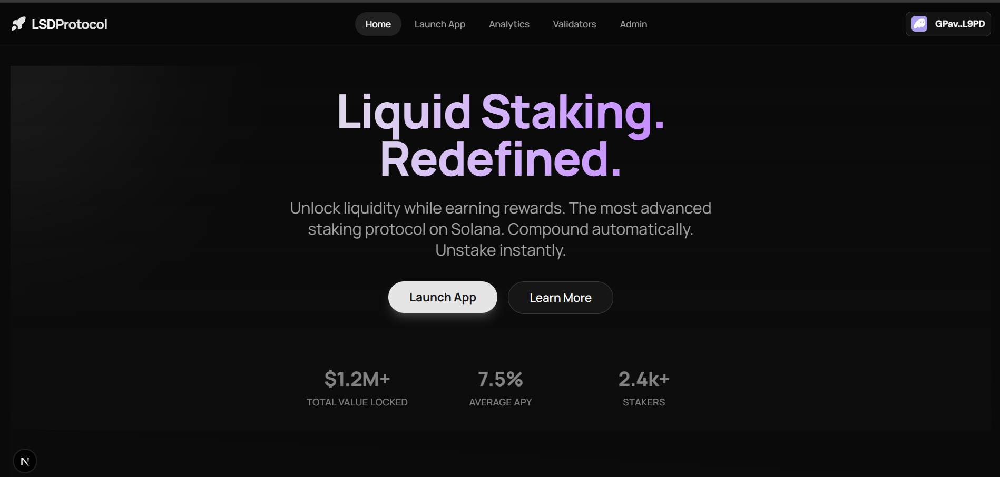

# LSD: Liquid Staking Derivative Protocol


> A high-performance, aesthetically driven interface for liquid staking on Solana, built to demonstrate "Startup Grade" design and full-stack dApp architecture.




## 🚀 Overview

LSD is a full-stack decentralized application (dApp) that allows users to stake SOL and receive receiving `soLSD` (Liquid Staking Token) in return. The project focuses on two core pillars:
1.  **Visual Excellence:** Delivering a "Series A" ready user experience with advanced animations, glassmorphism, and responsive layouts.
2.  **Full-Stack Architecture:** Integrating a custom Solana program (Anchor) with a modern Next.js frontend.

## 🛠 Tech Stack

-   **Frontend:** [Next.js 14](https://nextjs.org/), [TypeScript](https://www.typescriptlang.org/), [Tailwind CSS](https://tailwindcss.com/)
-   **Animations:** [Framer Motion](https://www.framer.com/motion/)
-   **Blockchain:** [Solana](https://solana.com/), [Anchor Framework](https://www.anchor-lang.com/), [Rust](https://www.rust-lang.org/)
-   **Integration:** [Solana Web3.js](https://solana-labs.github.io/solana-web3.js/), [Wallet Adapter](https://github.com/solana-labs/wallet-adapter)

## 🏗 Architecture

The system follows a standard dApp architecture where the client interacts directly with the Solana blockchain via RPC, utilizing Program Derived Addresses (PDAs) for secure asset management.

```mermaid
graph TD
    User((User))
    Wallet[Phantom/Backpack]
    FE[Next.js Client]
    RPC[Solana RPC Cluster]
    Program[Anchor Program (LSD)]
    Vault[(PDA Vault)]
    
    User -->|Connects| Wallet
    User -->|Interacts| FE
    FE -->|Signs Tx| Wallet
    Wallet -->|Submits Tx| RPC
    RPC -->|Calls| Program
    Program -->|Mints soLSD| User
    Program -->|Locks SOL| Vault
```

### 🧠 Design Decisions: The "Mock" Validator Strategy

To demonstrate the core mechanics of a Liquid Staking Protocol without the overhead of running a live Validation Service during development, this project implements a **Mock Validator Vault**.

-   **Real Implementation:** In a mainnet environment, the Anchor program would use Cross-Program Invocation (CPI) to delegate deposited SOL to the official Solana System Stake Program.
-   **This Implementation:** The program utilizes a PDA-controlled Vault (`stake_pool`) to hold user funds directly. Rewards are simulated by an admin `distribute_rewards` instruction which injects SOL into the vault, increasing the `soLSD` exchange rate mathematically.

This approach proves the "Exchange Rate" model (cToken model) used by protocols like Lido or Marinade, where `Price = Total_SOL / Total_Shares`.

## ✨ Features

-   **Dynamic Yield Simulation:** Demonstrates how token value increases over time relative to the underlying asset.
-   **Zero-Friction Staking:** "One-tick" staking experience with instant feedback.
-   **Responsive Design:** Fully optimized for Mobile, Tablet, and Desktop.
-   **Wallet Integration:** Robust state management for wallet connections and account data.

## ⚡ Getting Started

### Prerequisites
-   Node.js (v18+)
-   Rust & Cargo
-   Solana CLI
-   Anchor CLI

### 1. Installation

```bash
# Clone the repository
git clone <repo-url>
cd lsd

# Install dependencies
pnpm install
```

### 2. Start Local Validator

Run the local Solana test validator. This will also deploy the program to your local network.

```bash
pnpm anchor-localnet
```

### 3. Run the Frontend

```bash
pnpm dev
```

Open [http://localhost:3000](http://localhost:3000) to view the application.

## 🧪 Testing

The project includes a suite of integration tests to verify the staking logic and math safety.

```bash
pnpm anchor-test
```

---

*Built with ❤️ by [Your Name]*
